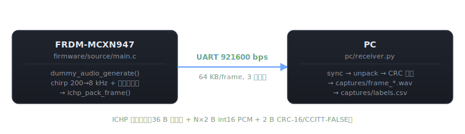

# IchiPing

> **イチ発のピンで、家のすべての窓を聴く**
> 1 個のマイクと NN で、連続音響空間内の窓・扉の開閉状態を **能動 chirp + RIR + 1D CNN** で同時推定するエッジ AI デバイス。

母プロジェクト: [airpocket-soundman/digikey_project §C4](https://github.com/airpocket-soundman/digikey_project) からピボットして専用リポジトリ化。応募先は DigiKey M1 / ROHM EDGE HACK 2026。

## ハードウェア前提（v1）

| 役割 | 部品 |
|---|---|
| MCU | **FRDM-MCXN947**（NPU + PowerQuad + I²S 多系統） |
| マイク | **INMP441**（I²S MEMS, 24-bit） — DC オフセット問題がなく chirp/RIR に好適 |
| スピーカ駆動 | MAX98357A I²S DAC + Class-D アンプ 3.2 W |
| サーボ駆動 | PCA9685（I²C, 16ch PWM）→ SG90 ×5 |
| 表示 | ILI9341 2.4" TFT 240×320 RGB565（SPI, FC3 LPSPI）。SH1106/SSD1306 OLED から差替え（[採用根拠](hardware/display_options.html)） |
| 補助センサ | BMP585 気圧（I²C, 0.1 Pa） |
| ストレージ | microSD（SPI, FatFs） |
| 通信 | USB-C CDC（PC 直結、第一案）／ ESP32-WROOM UART（任意） |
| UI | トグル ×5 + EXEC ボタン + LED ×2 |

詳細は [docs/spec.html](docs/spec.html) を参照。

## リポジトリ構成

```
IchiPing/
├── index.html / README.md       (このページ)
├── tasks.html                   タスクボード（v0.1〜v2.0）
├── CLAUDE.html / CLAUDE.md      Claude 向け作業ガイド
├── .vscode/                     VS Code ワークスペース設定
│   ├── extensions.json          推奨拡張
│   ├── settings.json            Python / テスト設定
│   └── launch.json              F5 起動構成（receiver/verify/emulator/unittest）
├── docs/
│   ├── spec.html                C4 仕様書（正本 digikey_project の完全コピー）
│   ├── nn_design.html           NN 詳細設計
│   ├── mcu_deployment.html      MCXN947 デプロイ手順（eIQ Toolkit）
│   ├── bringup.html             実機ブリングアップ手順
│   ├── vscode_setup.html        VS Code セットアップ
│   ├── style.css                共通サイドバー / レイアウト CSS
│   └── img/                     SVG 図（dataflow / frame_format / nn_arch ...）
├── hardware/
│   ├── wiring.html / wiring.md  GPIO ↔ デバイス端子マップ
│   ├── wiring.svg               視覚配線図（バス色分け）
│   ├── netlist.csv              機械可読ネットリスト
│   ├── bom.html / bom.csv       部品表（DigiKey M1 想定、必須計 ~$252）
│   └── display_options.html     ディスプレイ候補比較（SH1106 推奨）
├── firmware/                    MCUXpresso 用 C コード
│   ├── README.html / README.md
│   ├── include/
│   │   ├── ichiping_frame.h     フレーム形式（PC 側と共有する単一の真実）
│   │   └── dummy_audio.h
│   ├── source/
│   │   ├── main.c               SysTick + LPUART + フレーム送信
│   │   ├── ichiping_frame.c     ヘッダ + CRC-16/CCITT パッカー
│   │   └── dummy_audio.c        合成 chirp 200→8 kHz + xorshift32 残響
│   └── host_build/              gcc/MinGW でホストビルドする足場
│       ├── Makefile             .so/.dll を作って ctypes 突合テストに使う
│       └── README.md
└── pc/                          PC 側 Python（受信・検証・訓練）
    ├── README.html / README.md
    ├── ichp_frame.py            フレーム形式の単一情報源（Python 側）
    ├── receiver.py              シリアル/TCP/file → WAV + CSV ラベル保存
    ├── emulator.py              実機なしでフレームを生成する偽 MCU
    ├── verify.py                受信ストリームを 8 項目で検証する CLI
    ├── test_frame_format.py     ヘッダ/CRC ラウンドトリップ単体テスト（9 件）
    ├── test_loopback.py         emulator → receiver E2E テスト（6 件）
    ├── test_ctypes_packer.py    C ↔ Python パッカー突合（gcc 必要、無ければ skip）
    ├── environment.yml          conda 環境定義（PyTorch / ONNX 含む）
    ├── requirements.txt         venv 用最小依存
    └── training/                NN 訓練パイプライン（v0.5）
        ├── README.md
        ├── model.py             1D-CNN マルチタスク（~14K params）
        ├── features.py          WAV → 整合フィルタ → 1024-bin log-mag
        ├── dataset.py           captures/ PyTorch Dataset
        └── train.py             訓練 + ベスト保存 + ONNX エクスポート
```

## 現在のステータス: **v0.1 — シリアル疎通フェーズ**

実ハード（INMP441 / MAX98357A / PCA9685 …）をまだ繋がず、**MCU 内で合成した chirp+残響データを PC に流して保存パイプラインを通す**ところまでが目標。次に I²S MIC 取り込みに置き換えていく。



## クイックスタート

### 1. ファーム側

[firmware/README.md](firmware/README.md) を参照。要点:

1. MCUXpresso IDE で `frdmmcxn947` SDK から LPUART ベースのテンプレートを作成
2. `source/main.c` を本リポの [firmware/projects/01_dummy_emitter/main.c](firmware/projects/01_dummy_emitter/main.c) で置き換え、`ichiping_frame.c` + `dummy_audio.c` を追加、Include パスに `firmware/shared/include` を追加
3. ビルド → OpenSDA で書き込み

### 2. PC 側（conda 推奨）

```powershell
cd pc
conda env create -f environment.yml
conda activate ichiping
python receiver.py --port COM7 --baud 921600 --out ../captures
```

OpenSDA の COM ポート番号はデバイスマネージャで確認。venv 派の手順は [pc/README.md](pc/README.md) 参照。VS Code でセットアップする場合は [docs/vscode_setup.html](docs/vscode_setup.html) に従えば F5 で受信・検証が走る。

### 3. 動作確認用ユニットテスト（実機なし）

```powershell
cd pc
python -m unittest test_frame_format test_loopback -v
```

15 テストでカバー:
- `test_frame_format` 9 件: ヘッダ長 36 B、各フィールドのバイトオフセット、CRC-16/CCITT-FALSE の既知ベクタ、pack→unpack ラウンドトリップ
- `test_loopback` 6 件: `emulator.py` → `receiver.py` の E2E、`random_servo_angles` の C 互換性、chirp 構造

gcc/MinGW があれば `test_ctypes_packer.py` も走り、C 側 `ichp_pack_frame` と Python 側 `pack_frame` のバイト一致を 2 件で検証（無ければ自動 skip）。フレーム形式は MCU と PC で二重定義されており、ドリフトすると CRC が通らず実機通信が全滅するため、ここを実機到着前に必ず通す。

### 4. 受信ストリームの検証（実機到着後 / loopback 両対応）

```powershell
# 実機 100 フレームを 8 項目で検証、1 件でも FAIL なら exit 1
python verify.py --port COM7 --frames 100 --strict
# loopback: emulator が書いたファイルを検証
python verify.py --in ../captures/loopback.bin --strict
```

## 通信方式

**v0.1 は OpenSDA UART 921600 bps**（最も簡単に立ち上がる構成）。1 フレーム 64 KB を約 556 ms で転送、フレーム周期 3 秒なので帯域は余裕。USB CDC への置換は v0.3 以降のロードマップ項目。

## ロードマップ

- [x] v0.1: シリアル疎通 + ダミーデータ保存（**現状**）
- [ ] v0.2: I²S DAC（MAX98357A）からの chirp 放射、INMP441 からの実音取り込み
- [ ] v0.3: PowerQuad FFT で RIR 抽出、microSD への HDF5 保存
- [ ] v0.4: PCA9685 + SG90 ×5 を実装、3 部屋模型での自動データ収集
- [ ] v0.5: 1D CNN autoencoder（INT8）で全閉/開状態の二値分類
- [ ] v1.0: TFT (ILI9341) 表示 + EXEC ボタンによる手動デモモード完成
- [ ] v2.0: ML63Q2557 + Solist-AI への移植（ROHM EDGE HACK 提出版）

## ライセンス

未定（DigiKey/ROHM コンテスト応募後に MIT 想定）。
