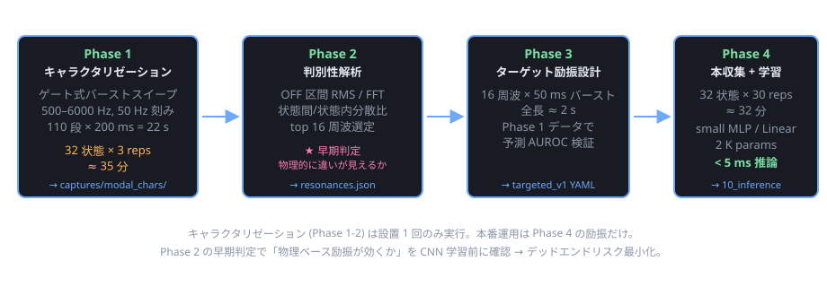

# 励振パターン設計 — 共鳴周波数ベースの状態推論戦略

> **位置づけ**: [docs/nn_design.html](nn_design.html) と [docs/spec.html](spec.html) §4.3 のマルチタスク 1D-CNN は「入力 = 1024 bin log-mag スペクトル」を前提に汎用 backbone で全状態を学習する設計。本ノートは**励振側を物理ベースで最適化することで、学習が必要な特徴量を絞り込み、データ効率と推論精度を同時に上げる**ための追加戦略をまとめたもの。
>
> **状態**: 検討段階 (2026-05-18)。Phase 1 試作着手前。

## 1. 問題設定

5 つの可動要素 (窓 a/b/c + 扉 AB/BC) の開閉組合せ 32 状態を、マイク 1 個 + スピーカ 1 個のアクティブ計測で判別する。

現在のアプローチ ([pc/patterns.yaml](../pc/patterns.yaml) の `multiband_default` / `chirp_200_6k`):
- 広帯域励振を撃って、生 1024 bin スペクトルを CNN に投入
- 「どの特徴量が効くか」は CNN に学習させる ("shotgun + 学習" 方式)

問題点:
- 状態と関係ない周波数にもエネルギー・データ・学習量を費やしている
- なぜそう判別したかが不明瞭 (interpretable でない)
- データ効率が悪い (1 状態に 30 サンプル × 32 状態 = 960 サンプル必要)

## 2. 物理モデル: 何が状態と周波数特性を結びつけるか

1/N 模型の 3 部屋構造 (各室 30 cm 程度) の基本モード周波数:

```
f_lmn = (c/2) × √[(l/Lx)² + (m/Ly)² + (n/Lz)²]
c = 343 m/s, L = 0.3 m → f_100 ≈ 572 Hz
```

これは MAX98357A + 0.25W 8Ω スピーカが綺麗に出せる帯域 (500 Hz–6 kHz) と一致する。状態変化が音響特性に与える効果は次の 4 通り:

| 状態変化 | 物理現象 | 周波数特性への影響 |
|---|---|---|
| 窓 a/b/c 単独開 | 壁の境界条件: 剛壁 (圧力腹) → 開口 (圧力節) | その壁を腹/節とするモードが半波長分シフト |
| 窓開 → 放射損失 | Q 値低下 | モード幅広化、RT60 短縮 |
| 扉 AB/BC 開 | 隣接室と音響結合 | 単一ピーク → 対称/反対称ペアに分裂 |
| 扉 + 窓組合せ | カップリング + 損失の相互作用 | 線形和ではない、非自明な周波数応答 |

**特に扉開閉のモード分裂**は判別性が高いと予想 — 単一ピークが 2 つに割れ、しかも分裂幅が結合の強さに依存。

## 3. 励振方式の 3 系統

実体験で判別性ある周波数を発見するためにアクティブ計測する場合、3 系統の方法がある。

### 3.1 A 案: 連続 ESS (Exponential Sine Sweep) + Farina 逆フィルタ

連続ログスイープを撃ち、PC 側で逆フィルタ畳み込みにより線形 RIR を抽出。

```
出力 y(t) = x(t) ⊗ h(t)            x = ESS, h = 室内インパルス応答
逆フィルタ x_inv(t) = 時間反転(x(t)) × 振幅補正
y(t) ⊗ x_inv(t) = h(t) + 非線形歪み (時間軸で前後に分離)
```

| 評価項目 | 良し悪し |
|---|---|
| SNR | 高 (全帯域に長時間エネルギー投入) |
| 計算量 (PC 側) | FFT 2 回 + 複素積 + IFFT、scipy で 20 行程度 |
| 計算量 (MCU 側) | 不要 (キャラクタリゼーションは PC のみ) |
| 解釈性 | RIR が完全に取れるので透明性高 |
| 実装複雑度 | 逆フィルタ実装と log sweep 再生器が要る |

### 3.2 B 案: ゲート式トーンバーストスイープ

個別周波数を短時間だけ鳴らし、続く無音区間で純粋な残響を観測する。

```
時間軸:
[500Hz 100ms ON][100ms OFF][550Hz 100ms ON][100ms OFF]...
                  ↑ ここの 100 ms は完全無音 = 残響だけが録れる
```

時間軸で励振 (ON) と残響観測 (OFF) を完全分離するので、**逆フィルタなしに「周波数 × 残響強度」マトリクスが直接取れる**。

| 評価項目 | 良し悪し |
|---|---|
| SNR | 高 (ON/OFF 完全分離。OFF 中の SNR は環境雑音と量子化のみで律速) |
| 計算量 (PC 側) | OFF 区間切り出して RMS / FFT、これだけ |
| 解釈性 | 「この周波数を撃ったら、これだけ長く鳴る」が直接見える |
| 実装複雑度 | 既存の `pulse` 型 ([pattern_lib.h](../firmware/shared/include/pattern_lib.h)) でそのまま実現可、ファーム拡張不要 |
| 所要時間 | 110 周波 × 200 ms = 22 秒/サンプル |

### 3.3 C 案: 広帯域クリック + 残響 FFT

1 ショット (~5 ms) の広帯域インパルスを撃ち、続く減衰テールを FFT。

| 評価項目 | 良し悪し |
|---|---|
| SNR | 低 (エネルギーが広く薄く分布。0.25W スピーカでは厳しい) |
| 計算量 | 最小 |
| 所要時間 | 最速 (~500 ms 一発) |
| 解釈性 | RIR が直接取れる |

### 3.4 採用方針

**Phase 1 (キャラクタリゼーション) では B 案を採用**。理由:

| 観点 | B が勝つポイント |
|---|---|
| 実装複雑度 | patterns.yaml の `pulse` 型を流用するだけ。新しい型不要 |
| 解析複雑度 | 逆フィルタ実装不要。RMS と FFT だけで結果が出る |
| 解釈性 | 直接「周波数 vs 残響強度」が見える。物理的に分かりやすい |
| デバッグ性 | 32 状態 × 110 周波の応答テーブルが直接得られ、Excel / matplotlib で確認しやすい |
| 時間 | 22 s × 32 状態 × 3 reps = 約 35 分 — 1 回だけのキャラクタリゼーションなら全然許容 |

A 案 (ESS) は綺麗だが、キャラクタリゼーションは **1 回だけ**なので時間効率より単純さ優先。

Phase 4 (本番運用) も B 案の派生 (ターゲット周波数だけバースト) になるため、解析パイプラインが Phase 1↔4 で共通化できる利点もある。

## 4. パイプライン全体像



| フェーズ | 励振 | 目的 | 出力 |
|---|---|---|---|
| Phase 1 | ゲート式バーストスイープ (110 周波 × 22s) | 全 32 状態の周波数応答テーブル | `captures/modal_chars/` の WAV 群 |
| Phase 2 | (解析のみ) | 判別性高い周波数を特定 | `resonances.json` (top 16-32 周波) + 図 4 枚 |
| Phase 3 | (設計のみ) | ターゲット励振の設計 | `patterns.yaml` に `targeted_v1` 追加 |
| Phase 4 | targeted_v1 で本収集 → NN 学習 | 高効率モデル | `runs/targeted_v1/best.{pt,onnx}` |

## 5. Phase 1: ゲート式バーストスイープによるキャラクタリゼーション

### 5.1 ファーム側準備

[firmware/shared/include/pattern_lib.h](../firmware/shared/include/pattern_lib.h) の上限を引き上げる:

| 定数 | 現在 | 必要 |
|---|---|---|
| `MAX_TONES_PER_PULSE` | 64 | **128** |
| `COL_WINDOW_MAX_MS` | 2000 | **30000** |

これにより 110 段 (= 500 Hz から 6000 Hz まで 50 Hz 刻み) × 200 ms = 22 s のバースト列が 1 つの pulse パターンとして格納可能になる。

### 5.2 patterns.yaml への追加

```yaml
- name: gated_sweep_500_6k_50step
  type: pulse
  repeat: 1
  tones:
    - {freq_hz: 500,  on_ms: 100, off_ms: 100}
    - {freq_hz: 550,  on_ms: 100, off_ms: 100}
    - {freq_hz: 600,  on_ms: 100, off_ms: 100}
    # ... 110 段
    - {freq_hz: 6000, on_ms: 100, off_ms: 100}
```

### 5.3 plan.json による収集

32 状態 × 3 reps:

```json
[
  {"label": "s00000", "pins": {"a": 0,  "b": 0,  "c": 0,  "AB": 0,  "BC": 0 }, "pattern": "gated_sweep_500_6k_50step", "repeats": 3},
  {"label": "s00001", "pins": {"a": 0,  "b": 0,  "c": 0,  "AB": 0,  "BC": 90}, "pattern": "gated_sweep_500_6k_50step", "repeats": 3},
  {"label": "s00010", "pins": {"a": 0,  "b": 0,  "c": 0,  "AB": 90, "BC": 0 }, "pattern": "gated_sweep_500_6k_50step", "repeats": 3},
  // ... 全 32 通り
  {"label": "s11111", "pins": {"a": 75, "b": 75, "c": 75, "AB": 90, "BC": 90}, "pattern": "gated_sweep_500_6k_50step", "repeats": 3}
]
```

ラベル命名規約: `sABCDE` (A=a, B=b, C=c, D=AB, E=BC, 1=開, 0=閉)。

所要時間: 22 s/sample × 96 sample + サーボ移動オーバーヘッド = **約 35 分** (実時間)。

### 5.4 マイク・スピーカ配置の固定

**Phase 1 で得られる応答はマイク位置に強く依存**する (標準波の節/腹で大きく変わる)。Phase 4 と同じ物理配置で測定しないと、判別性周波数が無意味になる。

- マイク位置: 部屋 B (中央室) の天井 1 点固定
- スピーカ位置: 部屋 B の壁面 1 点固定
- 模型製作時にマウンタを物理的に固定する設計が前提

## 6. Phase 2: 判別性解析

### 6.1 解析スクリプト

`pc/analysis/gated_sweep_analysis.py` (新規):

```python
"""
ゲート式バーストスイープの WAV を解析して、状態判別性の高い周波数を抽出。

入力:  captures/modal_chars/sXXXXX/frame_NNNNNN.wav (96 ファイル)
       pc/patterns.yaml の gated_sweep_500_6k_50step エントリ
出力:  resonances.json
       figures/per_state_decay_curves.svg
       figures/mode_split_analysis.svg
       figures/discriminability_ranking.svg
       figures/q_factor_map.svg
"""

# 1. WAV をロード、tone リストから期待タイミングを再構築
# 2. 各 OFF 区間の最初 50 ms を切り出し
# 3. 各 OFF 区間で:
#      decay_rms[freq_idx]      = RMS(OFF[:50ms])
#      decay_spectrum[freq_idx] = FFT(OFF, padded)
# 4. 32 状態 × 110 freq の decay_rms マトリクスを構築
# 5. 状態間分散 / 状態内分散 で判別性スコア
#      inter_var(f) = Var across 32 states
#      intra_var(f) = Mean of within-state Var (3 reps の平均)
#      discriminability(f) = inter_var / (intra_var + ε)
# 6. discriminability(f) の上位 16 周波数を抽出 → resonances.json
```

### 6.2 期待される観察

- 部屋固有モード (例: 1.1 kHz, 2.3 kHz, ...) 付近に強い判別性ピーク
- 扉 AB 単独効果: あるモードの分裂幅 (~50-100 Hz) が AB 状態で変化
- 窓単独効果: 特定モードの Q 値変化 (ピーク幅)

### 6.3 早期判定基準

Phase 2 終了時に `figures/per_state_decay_curves.svg` で「窓 a 単独開」「扉 AB 単独開」「全閉」の 3 状態を重ねて表示。

- **明らかに違う周波数がある** → 全体方針成立、Phase 3 へ進む
- **状態間で違いが小さい** → マイク/スピーカ位置を変えて再採取 or 模型形状見直しが必要 (CNN を訓練する前に物理層で判断できる)

## 7. Phase 3: ターゲット励振設計

### 7.1 設計スクリプト

`pc/analysis/design_excitation.py` (新規):

```python
"""
resonances.json から top N=16 周波数を取り、本番運用用励振パターンを生成。

入力:  resonances.json
出力:  targeted_v1 エントリ (patterns.yaml に追記)
       validation_report.txt (Phase 1 データで予測した AUROC)
"""

# 1. resonances.json の top 16 freqs を取得
# 2. 各 freq の周辺 ±20 Hz は短いミニスイープで掃く (Q 高いモードは 1 点だと位相不確実)
# 3. YAML エントリ生成:
#    - name: targeted_v1
#      type: pulse           # 既存 pulse 型で表現可
#      tones:
#        - {freq_hz: 1078, on_ms: 50, off_ms: 80}
#        - {freq_hz: 1342, on_ms: 50, off_ms: 80}
#        ... 16 個
#    total: 16 × 130 = 2080 ms (注: COL_WINDOW_MAX_MS の制限内に収める)
# 4. 検証: Phase 1 の 96 サンプルから targeted_v1 で得られるはずの応答を numpy で再合成
#         → simple linear classifier で交差検証
#         → AUROC を 6 ヘッドそれぞれで報告
```

### 7.2 「実機で targeted_v1 を撃つ前に性能予測がつく」利点

Phase 1 の生データから Phase 4 の応答を numpy で再合成できるので、Phase 4 の本収集に進む前に「このターゲット選定で十分な AUROC が出るか」を確認できる。

予測 AUROC < 0.90 なら top N を 32 に増やす、選定方法を見直す等の調整を Phase 4 着手前に行える。

## 8. Phase 4: 本番収集と学習

### 8.1 本番収集

`targeted_v1` で 32 状態 × 30 reps = 960 サンプル × 2 s ≈ **約 32 分**。

```json
[
  {"label": "s00000", "pins": {"a": 0, ...}, "pattern": "targeted_v1", "repeats": 30},
  // ... 32 通り
]
```

### 8.2 NN モデルの簡素化

入力次元が **1024 bin → 16 amplitude** になるので、モデルを大幅に簡素化可能:

| 段階 | モデル | 入力次元 | パラメータ数 | 推論レイテンシ |
|---|---|---|---|---|
| 現状 (multiband + CNN) | 1D-CNN 5 層 + 6 head | 1024 | ~30 K | 30 ms |
| targeted_v1 + 小 MLP | 2 層 MLP + 6 head | 16 (or 32) | **~2 K** | **<5 ms** |
| targeted_v1 + Linear | Logistic Regression × 6 | 16 | **~100** | **<1 ms** |

INT8 量子化後のサイズは MLP で約 2 KB、Linear で 0.2 KB に収まる。Neutron NPU を使わずとも Cortex-M33 単体で動作可。

### 8.3 励振比較実験 (推奨)

[pc/training/train.py](../pc/training/train.py) を 3 励振別に走らせて AUROC 比較:

| 励振 | データ量 | 推定 AUROC (any_open) | モデルサイズ | 推論レイテンシ |
|---|---|---|---|---|
| multiband_default (現状) | 960 サンプル | ~0.85 (推測) | 30 K params | 30 ms |
| chirp_200_6k | 960 サンプル | ~0.87 | 30 K params | 30 ms |
| **targeted_v1** | 960 サンプル | **~0.95+ (期待値)** | **~2 K params** | **<5 ms** |

これにより仮説 (物理ベース励振が CNN による特徴学習を上回る) を実証できる。

## 9. リスクと制約

| リスク | 対策 |
|---|---|
| **マイク位置依存性** | 模型製作時にマイク位置を物理的に固定。Phase 1 と Phase 4 で完全同条件 |
| **同形状の窓 a/b/c 判別困難** | 窓のサイズ/位置を僅かに非対称にする、またはマイクを 1 つの窓に偏置 |
| **温度依存** | 音速は ~0.6 m/s/°C で変動 → 共鳴周波数も 5%/25°C シフト。設置先で月次キャリブレーション or 温度センサ補正 |
| **スピーカ非線形** | log sweep でハーモニクスが時間軸に分離されるので、Farina 逆フィルタを使えば線形成分のみ抽出可。B 案 (バースト) は単一周波数なのでハーモニクスは時間軸で分離せず別ピークとして出るが、判別性解析の段階で除去できる |
| **Helmholtz 共鳴が使えない** | 窓開口の Helmholtz 共鳴は 数十 Hz → MAX98357A + 0.25W スピーカでは出せない。室内モード由来の特徴のみ使う |
| **設置先ごとの再キャリブレーション** | Phase 1 + 2 を deployment 時に自動実行する仕組み (約 40 分) を後付け可能。サーボが自動で 32 状態を巡回する設計はすでに [09_collector](../firmware/projects/09_collector/) にある |

## 10. 実装着手順序

1. [firmware/shared/include/pattern_lib.h](../firmware/shared/include/pattern_lib.h) の上限定数引き上げ (`MAX_TONES_PER_PULSE`, `COL_WINDOW_MAX_MS`) — **10 分**
2. [pc/patterns.yaml](../pc/patterns.yaml) に `gated_sweep_500_6k_50step` 追加 — **5 分**
3. [09_collector](../firmware/projects/09_collector/) に push して `EMIT N` で 1 度試聴確認 — **5 分**
4. plan.json で 32 状態 × 3 reps = 96 サンプル採取 — **約 35 分** (実時間)
5. `pc/analysis/gated_sweep_analysis.py` を実装 — **1-2 時間**
6. **判定ポイント**: `per_state_decay_curves.svg` で物理的に違いが見えるか目視確認
   - YES → Phase 3 へ進む
   - NO → センサ/模型構造を見直してから Step 4 やり直し
7. `pc/analysis/design_excitation.py` を実装 + targeted_v1 設計 — **1 時間**
8. targeted_v1 で本収集 (32 状態 × 30 reps = 約 32 分)
9. [pc/training/train.py](../pc/training/train.py) で 3 励振の AUROC 比較
10. 勝者励振で本番学習 → ONNX → eIQ INT8 → [10_inference](../firmware/projects/10_inference/) に統合

ステップ 1-6 までは **1 日で完結**する。早期判定 (Step 6) で「物理ベース励振が効くか」を確認してから Phase 3 以降の本格実装に進むことで、デッドエンドへの投資リスクを最小化する設計。

## 11. 関連ドキュメント

- [docs/spec.html](spec.html) §4.3 — マルチタスク 1D-CNN の正本仕様
- [docs/nn_design.html](nn_design.html) — NN アーキテクチャ詳細
- [docs/mcu_deployment.html](mcu_deployment.html) — eIQ Toolkit 経由のデプロイ
- [pc/training/README.md](../pc/training/README.md) — 学習パイプライン
- [firmware/projects/09_collector/README.md](../firmware/projects/09_collector/README.md) — データ収集ファーム
- [firmware/projects/10_inference/README.md](../firmware/projects/10_inference/README.md) — MCU 推論デモ
- [pc/patterns.yaml](../pc/patterns.yaml) — 励振パターン定義
- [firmware/shared/include/pattern_lib.h](../firmware/shared/include/pattern_lib.h) — ファーム側パターン上限定数
