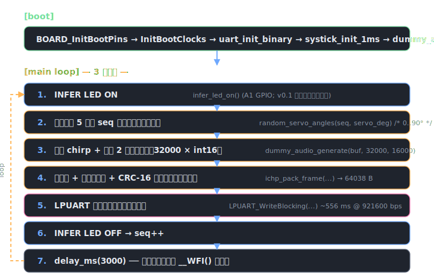

# IchiPing firmware

MCUXpresso 用の最小スケルトン。**まだ実ハード（INMP441 マイク / MAX98357A / PCA9685 など）には触らず**、合成 chirp + 残響テールを生成して OpenSDA デバッグ UART に流すだけ。PC 側 ([../pc/receiver.py](../pc/receiver.py)) と組み合わせて、シリアル経路と保存パイプラインを先に通すための足場。

## 構成

```
firmware/
├── include/
│   ├── ichiping_frame.h   フレーム形式定義（PC 側と共有する単一の真実）
│   └── dummy_audio.h
├── source/
│   ├── main.c             SysTick + LPUART + フレーム送信ループ
│   ├── ichiping_frame.c   ヘッダ・ペイロード・CRC-16/CCITT パッカー
│   └── dummy_audio.c      合成 chirp 200→8 kHz + xorshift32 ホワイトノイズ残響
├── host_build/            gcc/MinGW でホストビルドする足場
│   ├── Makefile           .so/.dll を作って ctypes 突合テストに使う
│   └── README.md
└── README.md / README.html
```

## ビルド手順（MCUXpresso IDE）

1. **MCUXpresso SDK for FRDM-MCXN947** をインストール（11.9 以降）
2. `File > New > Create a new C/C++ Project` → `frdmmcxn947` → 例として `driver_examples > lpuart > polling_transfer` をベースに作成
3. プロジェクト名を `ichiping_dummy` などに変更
4. デフォルトの `main.c` を本リポの [source/main.c](source/main.c) で置き換え
5. プロジェクトに以下のソースを追加:
   - [source/ichiping_frame.c](source/ichiping_frame.c)
   - [source/dummy_audio.c](source/dummy_audio.c)
6. `Properties > C/C++ Build > Settings > Includes` に `${ProjDirPath}/../firmware/include` を追加（あるいはヘッダを `source/` 直下にコピー）
7. ビルドして OpenSDA で書き込み → 緑の `PWR` LED 想定箇所 (Arduino A0) は未配線でも問題なし

## シリアル設定

- ボード: FRDM-MCXN947、OpenSDA デバッグ COM ポート
- ボーレート: **921600 bps**（PC 側もこの値）
- 8N1、フロー制御なし
- バイナリ転送のため **端末ソフトでは開かないこと**（[../pc/receiver.py](../pc/receiver.py) で受ける）

## 動作シーケンス



## フレーム形式

[include/ichiping_frame.h](include/ichiping_frame.h) が単一の真実（single source of truth）。PC 側は [../pc/ichp_frame.py](../pc/ichp_frame.py) の `HEADER_FMT` を同期させる。ドリフトすると CRC が通らず無音状態になるため、**ヘッダ変更時は必ず両方を更新**し `python -m unittest test_frame_format -v` で 9 テスト全パスを確認すること。


> **ホストビルドの可能性**: `ichiping_frame.c` / `dummy_audio.c` は MCUXpresso SDK 非依存（`<stdint.h>` / `<string.h>` / `<math.h>` のみ）。gcc / MSVC で .dll/.so 化し、Python から ctypes で呼んで PC 側パッカーと突合テストできる（[host_build/](host_build/) 参照、タスク IP-0.1.7）。

## TODO（実ハード接続フェーズ）

- [ ] `BOARD_LED_INFER_*` を MCUXpresso Config Tools で定義 → `infer_led_on/off()` の `GPIO_PinWrite` を有効化
- [ ] `dummy_audio_generate` → I²S SAI1 RX からの DMA リングバッファ受信に置き換え
- [ ] サーボ角は PCA9685 への現在指令角度を返すように接続
- [ ] OpenSDA UART → **USB CDC** にアップグレード（フレーム転送 556 ms → 50 ms 程度）
- [ ] ホスト送 → MCU 受向きを足し、PC からのコマンド（収集セッション開始/サーボ角度指定）を受け付ける

## 参考

- バスとピンの割当: [../hardware/wiring.md](../hardware/wiring.md)
- 視覚配線図: [../hardware/wiring.svg](../hardware/wiring.svg)
- システム全体仕様: [../docs/spec.html](../docs/spec.html)
