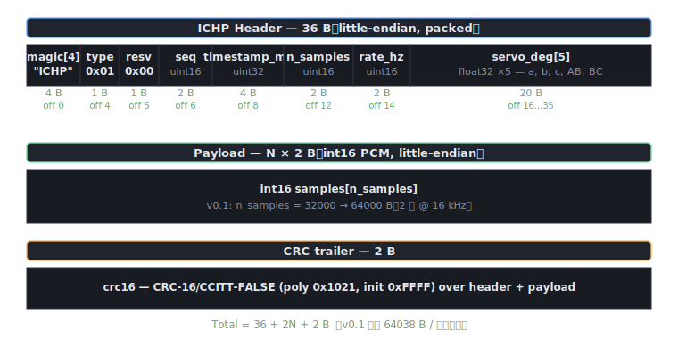

# IchiPing PC 受信側

MCU から **OpenSDA UART 921600 bps** で流れてくる IchiPing バイナリフレームを読み、**WAV + CSV ラベル**として保存する Python スクリプト。

## なぜ UART か（v0.1）

|  | OpenSDA UART | USB CDC |
|---|---|---|
| 実装難易度 | ★（LPUART init + WriteBlocking 1 関数） | ★★★（USB スタック・クラスドライバ・エンドポイント） |
| 1 フレーム（64 KB）転送時間 | 約 556 ms @ 921600 | 約 50 ms @ 12 Mbps |
| 結線 | 既存 OpenSDA で完結（追加配線なし） | 既存 USB-C で完結 |
| 採用判断 | **v0.1 で採用** — 立ち上げ最短 | v0.3 以降で置換予定 |

v0.1 の目的（シリアル経路と保存パイプラインを通す）には UART で十分。

## セットアップ — conda（推奨）

```powershell
# Miniconda / Anaconda 前提
conda env create -f environment.yml
conda activate ichiping
```

更新したいとき:
```powershell
conda env update -f environment.yml --prune
```

削除:
```powershell
conda deactivate
conda env remove -n ichiping
```

## セットアップ — venv（conda を使わない場合）

```powershell
python -m venv .venv
.\.venv\Scripts\Activate.ps1
pip install -r requirements.txt
```

## 実行

### A. 実機が繋がっている場合（OpenSDA から取得）

```powershell
# デバイスマネージャで FRDM-MCXN947 の OpenSDA COM 番号を確認（例: COM7）
python receiver.py --port COM7 --baud 921600 --out ../captures
```

### B. 実機なしでパイプラインを試す（loopback）

```powershell
# 偽 MCU が 10 フレームをファイルに書き出す
python emulator.py --out ../captures/loopback.bin --frames 10 --cadence 0
# それを receiver.py で読んで WAV+CSV に保存
python receiver.py --in ../captures/loopback.bin --out ../captures
```

### C. 受信ストリームを期待値と突合（CI 向き）

```powershell
# 実機 100 フレームを 8 項目で検証、1 件でも FAIL なら exit 1
python verify.py --port COM7 --frames 100 --strict
# loopback ファイルを検証
python verify.py --in ../captures/loopback.bin --strict
```

期待される `receiver.py` の出力:

```
opening serial:COM7@921600
writing to D:\GitHub\IchiPing\captures
waiting for frames... (Ctrl+C to stop)
[     0] t=    3001ms sr=16000 N=32000 servos=[ 17.0, 65.0, 82.0,  3.0, 41.0] CRC=OK (0.33 fps)
[     1] t=    6002ms sr=16000 N=32000 servos=[ 33.0, 12.0,  7.0, 88.0, 56.0] CRC=OK (0.33 fps)
...
```

`Ctrl+C` で停止。保存先:

```
captures/
├── labels.csv             各フレームのメタ + サーボ角度
├── frame_000000.wav       2 秒分の 16 kHz mono PCM
├── frame_000001.wav
└── ...
```

## オプション (`receiver.py`)

| フラグ | 用途 |
|---|---|
| `--port` | シリアルポート (例: COM7、`--port` / `--tcp` / `--in` のいずれか必須) |
| `--tcp HOST:PORT` | TCP サーバから読む（emulator の TCP モードと組み合わせ） |
| `--in PATH` | バイナリファイルから読む（オフラインリプレイ） |
| `--baud` | シリアルボーレート（既定 921600） |
| `--out` | 出力ディレクトリ（既定 `./captures`） |
| `--max-frames N` | N フレーム受信したら自動終了（既定 0 = 無制限） |
| `--keep-bad-crc` | CRC 不一致フレームも保存（デバッグ用） |

## トラブルシュート

| 症状 | 対処 |
|---|---|
| `PermissionError` で開けない | 同じ COM を他端末（TeraTerm 等）が掴んでいる。閉じる |
| `frame error: only got X/Y bytes` が連発 | ボーレート不一致。MCU 側 `ICHP_UART_BAUD` と一致させる |
| CRC BAD が定期的 | バッファ溢れ。`fc.serial_rx_buffer_size` を大きく、もしくは MCU 側のフレーム周期を伸ばす |
| 何も来ない | ・LED が点灯しているか / ファームが起動しているか<br>・COM 番号合っているか<br>・USB ケーブルがデータ通信対応か |

## テスト（実機なし）

フレーム形式は MCU 側 [../firmware/shared/include/ichiping_frame.h](../firmware/shared/include/ichiping_frame.h) と PC 側 [ichp_frame.py](ichp_frame.py) で二重定義される。両者がドリフトすると CRC が通らず実機通信が全滅するため、PC 側だけは自動テストで守る:

```powershell
cd pc
python -m unittest test_frame_format test_loopback -v
```

15 テストでカバー:
- `test_frame_format` 9 件: ヘッダ長 36 B、各フィールドのバイトオフセット、CRC-16/CCITT-FALSE 既知ベクタ（`"123456789"` → `0x29B1`）、pack→unpack ラウンドトリップ、エラー系（不正 magic / 不正 servo 個数 等）
- `test_loopback` 6 件: `emulator.py` → `receiver.py` の E2E、`random_servo_angles` の C 互換性、chirp 構造

gcc/MinGW があれば `test_ctypes_packer.py` も走り、C 側 `ichp_pack_frame` と Python 側 `pack_frame` のバイト一致を 2 件で検証（無ければ自動 skip。[../firmware/host_build/README.md](../firmware/host_build/README.md) 参照）。

**MCU 側の `ichp_frame_header_t` を変更したときは、合わせて `ichp_frame.py` の `HEADER_FMT` を更新してこのテストを通すこと。**

## モジュール構成

| ファイル | 役割 |
|---|---|
| [`ichp_frame.py`](ichp_frame.py) | フレーム形式の単一情報源（Python 側）。`MAGIC` / `HEADER_FMT` / `crc16_ccitt` / `pack_frame` / `unpack_header` |
| [`receiver.py`](receiver.py) | シリアル / TCP / ファイル → CRC 検証 → WAV+CSV 保存のメインスクリプト |
| [`emulator.py`](emulator.py) | 実機なしでダミーフレームを生成する偽 MCU。stdout / TCP / file の 3 出口 |
| [`verify.py`](verify.py) | 受信ストリームを 8 項目（type/CRC/seq 連番/ts 単調/n_samples/rate/サーボ範囲/サンプル範囲）で検証する CLI。`--strict` で CI 利用可 |
| [`test_frame_format.py`](test_frame_format.py) | unittest 9 件。ヘッダ層 + CRC ラウンドトリップ |
| [`test_loopback.py`](test_loopback.py) | unittest 6 件。emulator → receiver E2E |
| [`test_ctypes_packer.py`](test_ctypes_packer.py) | unittest 2 件。C ↔ Python パッカーをバイト比較（gcc 必要、無ければ skip） |
| [`training/`](training/) | NN 訓練パイプライン（v0.5）— `model.py` / `features.py` / `dataset.py` / `train.py` |
| `environment.yml` | conda 環境定義（PyTorch / ONNX / pyroomacoustics 含む） |
| `requirements.txt` | venv 用最小依存 |

## フレームフォーマット

[../firmware/shared/include/ichiping_frame.h](../firmware/shared/include/ichiping_frame.h) が正本。Python 側は [ichp_frame.py](ichp_frame.py) の `HEADER_FMT` を同期させる。


